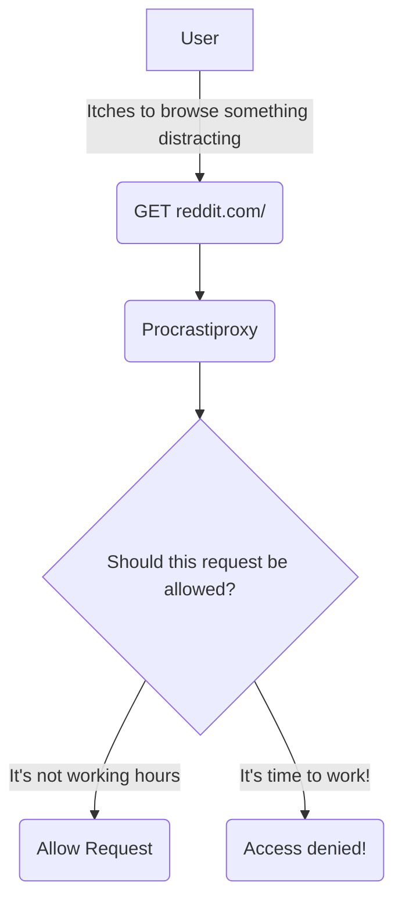

# Overview

Procrastiproxy is a simple, configurable proxy that helps you focus by blocking distracting websites.

It implements an in-memory, mutable list for tracking hosts that should be blocked. This in-memory list allows for fast (`O(1)` or "constant time") look-ups of blocked hosts.



# Getting started

**Install with one command**

To install procrastiproxy as a command-line interface (CLI) tool, you can execute the install script:

```
curl https://raw.githubusercontent.com/zackproser/procrastiproxy/main/install.sh | bash
```

**Install as a library**

You can import procrastiproxy into your own project:

```golang
import github.com/zackproser/procrastiproxy
```

**Install via Go**

You can install and use procrastiproxy as a command line interface (CLI) tool:

```bash
go install github.com/zackproser/procrastiproxy
```

# Running locally

`go build`

`./procrastiproxy 8001 --config .procrastiproxy.yaml`

# Features

## Configurable and dynamic block list

The block list is in memory and is implemented as a map for fast lookups. You can set your baseline block list in `.procrastiproxy.yaml`. It can be modified at runtime via the admin control endpoints described below.

## Admin control

Make a request to the `<server-root>/admin/` path, passing either `block` or `unblock` followed by a host, like so:

### Add a new host to the block list

`curl http://localhost:8001/admin/block/reddit.com`

### Remove a host from the block list

`curl http://localhost:8001/admin/unblock/reddit.com`

## Office hours

If a request is made to procrastiproxy within the configured office hours, the request will be examined and blocked if its host is on the block list. If a request is made to procrastiproxy outside of the configured office hours, it will be allowed.

# Running tests

Procrastiproxy comes complete with tests to verify its functionality.

`go test`
